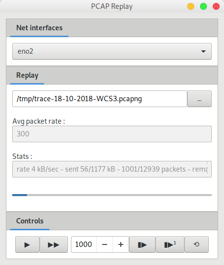

PCAP Replay is a small pcap/pcapng file replay tool over network *like* tcpreplay.

 

The goal of this tool are :
--

* being able to be compiled for Windows, as there is a real lack of tool like tcpreplay for this OS
* step by step functionnality when you need to be able to replay packets one at a time

Dependencies :
--

* [gopacket](https://github.com/google/gopacket) for the libpcap abstraction
* [andlabs ui](https://github.com/andlabs/ui) for the MMI
* [urfave cli](https://github.com/urfave/cli) for command line parsing

Build :
--

You will have to enable go mod fonctinality to be able to build this project :

* export GO111MODULE=on
* go mod vendor

### Usage :

pcapreplay can be used like tcpreplay on the command line only, but you can also ask for a MMI to be able to use step by step functionnality.

Command line options :

* --intf
  * OS dependent network interface ID
* --fast
  * Disable using sleep calls between each packet, will replay the file as fast as possible, may not be really usefull
* --pcap
  * Wich pcap file to replay (can be a pcap or pcapng type file)
* --gui
  * If you want to use the step by step mode, or if it is easier for you

License
-------
This project is licensed under the [BSD-3 License](https://opensource.org/licenses/BSD-3-Clause).
